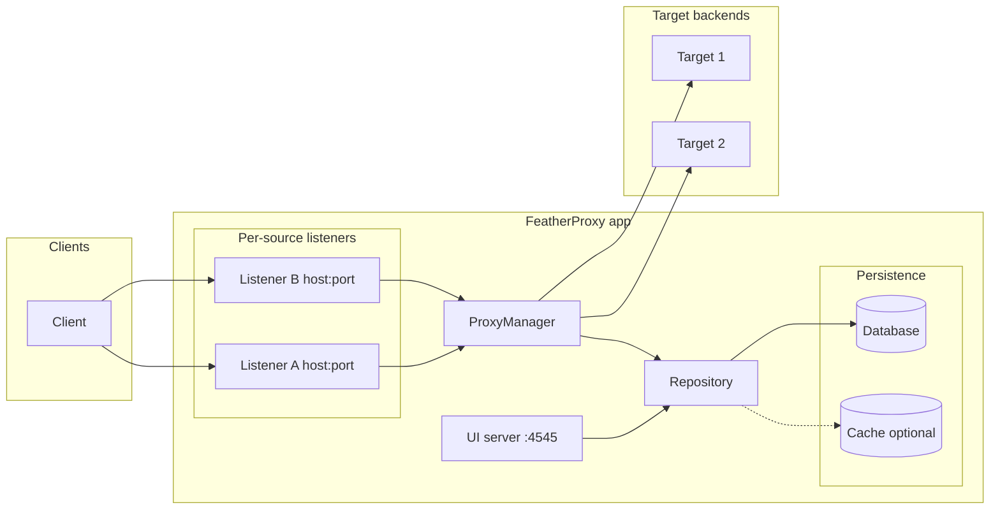

# FeatherProxy
FeatherProxy is an OSS proxy gateway for your API routing needs.

## Architecture

- **Repository** — Single persistence interface for source/target servers, routes, and authentications. Used by both the UI server and the proxy.
- **Caching** — Optional: `CACHING_STRATEGY` (`none`, `memory`, or `redis`) and `CACHE_TTL` in env. When enabled, the repository caches reads (e.g. routes, server lists, auth metadata) and invalidates on writes. Sensitive data (e.g. decrypted tokens) is never cached.
- **Authentication** — Stored in the repository with tokens encrypted at rest. The UI uses the repository for CRUD (masked tokens in responses). The proxy uses `GetTargetAuthenticationWithPlainToken` (DB only, not cached) when forwarding requests to backends.