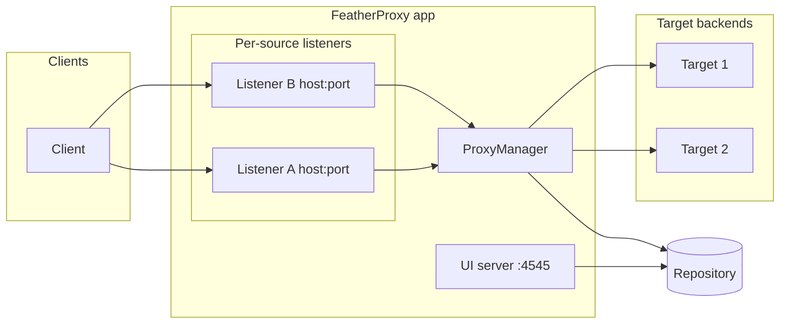

# FeatherProxy
FeatherProxy is an OSS proxy gateway for your API routing needs.

## Architecture

```mermaid
flowchart LR
  subgraph clients [Clients]
    C[Client]
  end
  subgraph app [FeatherProxy app]
    UI[UI server :4545]
    Mgr[ProxyManager]
    subgraph listeners [Per-source listeners]
      L1[Listener A host:port]
      L2[Listener B host:port]
    end
  end
  subgraph backends [Target backends]
    T1[Target 1]
    T2[Target 2]
  end
  C --> L1
  C --> L2
  L1 --> Mgr
  L2 --> Mgr
  Mgr --> T1
  Mgr --> T2
  UI --> DB[(Repository)]
  Mgr --> DB
```