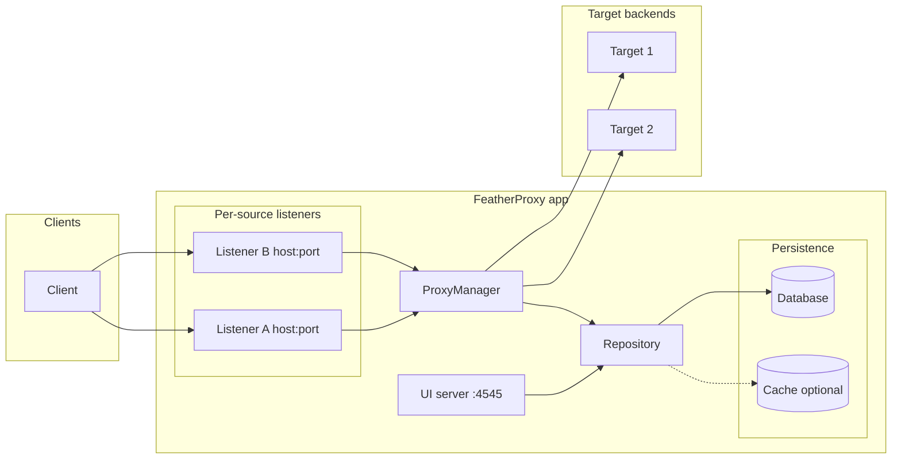

# FeatherProxy

FeatherProxy is an open-source **API gateway** that routes incoming requests to your backends. You define **source** listeners (host:port), **routes** (method + path), and **target** servers; the proxy forwards matching traffic and can attach stored authentication (e.g. API tokens) to outbound requests.

## What it does

- **Listen** on one or more addresses (HTTP or HTTPS), each tied to a “source server.”
- **Match** each request by method and path to a **route**, which points to a **target** backend (protocol, host, port, path).
- **Forward** the request to the target, optionally adding authentication (tokens stored encrypted, decrypted only when proxying).
- **Manage** everything via the built-in UI (default: `http://localhost:4545`) or by extending the API.

## Quick start

**Prerequisites:** [Go](https://go.dev/) 1.21+ (or as required by `app/go.mod`).

1. Clone the repo and go to its root:
   ```bash
   git clone https://github.com/your-org/FeatherProxy.git && cd FeatherProxy
   ```
2. Configure the app (all code lives in `app/`):
   ```bash
   cp app/.env.example app/.env
   ```
   Edit `app/.env` and set at least:
   - **`DB_DRIVER`** and **`DB_DSN`** — e.g. `sqlite` and `file:data.db`, or PostgreSQL (see [Configuration](#configuration)).
3. Run the app:
   ```bash
   make run
   ```
4. Open **http://localhost:4545** in a browser. Use the UI to create:
   - **Source servers** — the host:port (and optional TLS) the proxy listens on.
   - **Target servers** — the backends (protocol, host, port, base path).
   - **Routes** — which method + path on a source map to which target path (and optional auth).

After you add a source server, the proxy starts listening on that address; traffic that matches a route is forwarded to the corresponding target.

## Building

From the repo root:

```bash
make build
```

This produces **`app/featherproxy`**. Run it from `app/` (so it finds `app/.env`) or set your config via environment variables.

## Architecture



- **Clients** hit the proxy on the host:port of a **source server**.
- **Proxy** (per-source listeners) receives the request, looks up a **route** by (source, method, path), resolves the **target server**, and reverse-proxies to the backend.
- **Repository** is the single persistence layer for source/target servers, routes, and authentications. Both the UI server and the proxy use it.
- **Database** holds all state; an optional **cache** (memory or Redis) can speed up reads; sensitive data (e.g. decrypted tokens) is never cached.

## Configuration

Create `app/.env` from `app/.env.example`. Main options:

| Variable | Description |
|----------|-------------|
| `DB_DRIVER` | Database driver: `sqlite` or `postgres`. |
| `DB_DSN` | Connection string. SQLite example: `file:data.db`. Postgres: `host=localhost user=feather password=… dbname=featherproxy port=5432 sslmode=disable`. |
| `AUTH_ENCRYPTION_KEY` | Required if you use authentications. At least 32 bytes (e.g. `openssl rand -base64 32`). Tokens are encrypted at rest. |
| `CACHING_STRATEGY` | `none`, `memory`, or `redis`. When set, the repository caches reads and invalidates on writes. |
| `CACHE_TTL` | Optional. TTL for cached entries (e.g. `5m`, `1h`). Default 5m. |
| `REDIS_HOST`, `REDIS_PORT`, `REDIS_PASSWORD`, `REDIS_DB` | Used when `CACHING_STRATEGY=redis`. |

## Features in brief

- **Repository** — Single interface for source/target servers, routes, and authentications. Used by both the UI and the proxy; no direct DB access in HTTP or proxy code.
- **Caching** — Optional (`CACHING_STRATEGY` and `CACHE_TTL`). When enabled, the repository caches reads (e.g. routes, server lists, auth metadata) and invalidates on writes. Sensitive data (e.g. decrypted tokens) is never cached.
- **Authentication** — Stored in the repository with tokens encrypted at rest. The UI uses the repository for CRUD (tokens are masked in API responses). The proxy uses a dedicated method (DB only, not cached) to get the plain token when forwarding to backends.

## License

See [LICENSE](LICENSE).
