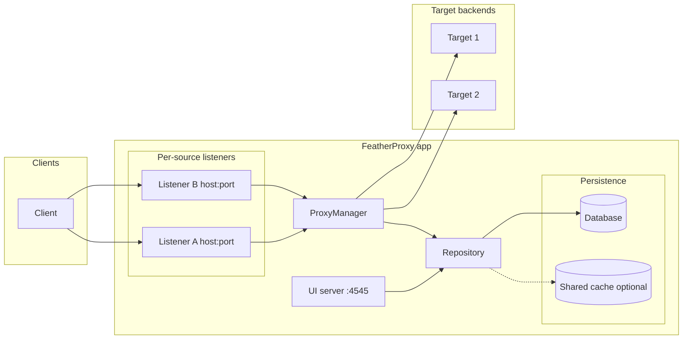

# FeatherProxy

FeatherProxy is an open-source **API gateway** that routes incoming requests to your backends. You define **source** listeners (host:port), **routes** (method + path), and **target** servers; the proxy forwards matching traffic and can attach stored authentication (e.g. API tokens) to outbound requests.

## What it does

- **Listen** on one or more addresses (HTTP or HTTPS), each tied to a “source server.”
- **Match** each request by method and path to a **route**, which points to a **target** backend (protocol, host, port, path).
- **Forward** the request to the target, optionally adding authentication (tokens stored encrypted, decrypted only when proxying).
- **Control access** with optional per–source-server ACLs (allow/deny lists of client IPs/CIDRs, using a configurable header or the connection address).
- **Record statistics** for each successfully proxied request (async, batched). Metrics include routes called, callers (client IPs), server-level aggregation, TPS, and status breakdown (2xx/4xx/5xx). View and clear stats from the UI; old data is vacuumed automatically.
- **Manage** everything via the built-in UI (default: `http://localhost:4545`) or by extending the API.

## Quick start

**Prerequisites:** [Docker](https://docs.docker.com/get-docker/).

1. Pull the image from GitHub Container Registry:
   ```bash
   docker pull ghcr.io/ghhwer/featherproxy:latest
   ```
2. Run the container with the UI on port 4545 and a volume for persistent data:
   ```bash
   docker run -d --name featherproxy -p 4545:4545 \
     -v featherproxy-data:/app/data \
     -e DB_DRIVER=sqlite \
     -e DB_DSN=file:/app/data/data.db \
     ghcr.io/ghhwer/featherproxy:latest
   ```
3. Open **http://localhost:4545** in a browser. Use the UI to create:
   - **Source servers** — the host:port (and optional TLS) the proxy listens on.
   - **Target servers** — the backends (protocol, host, port, base path).
   - **Routes** — which method + path on a source map to which target path (and optional auth).

After you add a source server, the proxy starts listening on that address; traffic that matches a route is forwarded to the corresponding target. To stop: `docker stop featherproxy`. To remove: `docker rm featherproxy` (the volume `featherproxy-data` keeps your data).

## Building and running from source

**Prerequisites:** [Go](https://go.dev/) 1.21+ (or as required by `app/go.mod`).

1. Clone the repo and copy env config:
   ```bash
   git clone https://github.com/your-org/FeatherProxy.git && cd FeatherProxy
   cp app/.env.example app/.env
   ```
   Edit `app/.env` and set at least **`DB_DRIVER`** and **`DB_DSN`** (see [Configuration](#configuration)).
2. Build and run:
   ```bash
   make build   # produces app/featherproxy
   make run     # or run app/featherproxy from app/
   ```

Run from `app/` so the binary finds `app/.env`, or set config via environment variables.

## Docker

Build the image (default tag `featherproxy:latest`):

```bash
make docker-build
```

Run the container (UI on port 4545). Pass env vars or mount a volume for persistence:

```bash
# Minimal: in-memory SQLite (data lost when container stops)
make docker-run

# With a volume for SQLite and env from app/.env
docker run --rm -p 4545:4545 -v $(pwd)/app/data:/app/data \
  -e DB_DRIVER=sqlite -e DB_DSN=file:/app/data/data.db \
  --env-file app/.env featherproxy:latest
```

Log in to the registry first (`docker login ghcr.io` or `docker login` for Docker Hub).

## Architecture



- **Clients** hit the proxy on the host:port of a **source server**.
- **Proxy** (per-source listeners) receives the request, looks up a **route** by (source, method, path), resolves the **target server**, and reverse-proxies to the backend.
- **Repository** is the single persistence layer for source/target servers, routes, and authentications. Both the UI server and the proxy use it.
- **Database** holds all state; an optional **shared cache** (memory or Redis) can speed up reads; sensitive data (e.g. decrypted tokens) is never cached.

## Configuration

Create `app/.env` from `app/.env.example`. Main options:

| Variable | Description |
|----------|-------------|
| `DB_DRIVER` | Database driver: `sqlite` or `postgres`. |
| `DB_DSN` | Connection string. SQLite example: `file:data.db`. Postgres: `host=localhost user=feather password=… dbname=featherproxy port=5432 sslmode=disable`. |
| `AUTH_ENCRYPTION_KEY` | Required if you use authentications. At least 32 bytes (e.g. `openssl rand -base64 32`). Tokens are encrypted at rest. |
| `CACHING_STRATEGY` | `none`, `memory`, or `redis`. When set, the repository caches reads and invalidates on writes. |

## Features in brief

- **Repository** — Single interface for source/target servers, routes, and authentications. Used by both the UI and the proxy; no direct DB access in HTTP or proxy code.
- **Caching** — Optional (`CACHING_STRATEGY` and `CACHE_TTL`). When enabled, a single shared cache instance (memory or Redis stub) is created from env and used by both the repository (for reads with invalidation on writes) and the proxy’s DNS ACL hostname resolver. Sensitive data (e.g. decrypted tokens) is never cached.
- **Authentication** — Stored in the repository with tokens encrypted at rest. The UI uses the repository for CRUD (tokens are masked in API responses). The proxy uses a dedicated method (DB only, not cached) to get the plain token when forwarding to backends.
- **Statistics** — A background stats service records each successfully proxied request asynchronously (non-blocking). Events are batched by count and/or flush interval, then written to the database. The UI shows a **Stats** section with: summary (total, last 24h, 2xx/4xx/5xx counts, TPS), recent requests table, aggregations by route, by caller (client IP), by source/target server, and requests over time (TPS buckets). You can clear all metrics from the UI; a periodic vacuum deletes data older than `STATS_RETENTION_DAYS`. Config: `STATS_BATCH_SIZE`, `STATS_FLUSH_INTERVAL`, `STATS_CHANNEL_CAP`, `STATS_RETENTION_DAYS` (see [Configuration](#configuration)).
- **Access control lists (ACLs)** — Per–source-server ACL options let you define allow/deny lists of client IPs/CIDRs **and hostnames**. ACL entries may be:
  - exact IPs (e.g. `192.168.1.10`, `2001:db8::1`)
  - CIDRs (e.g. `10.0.0.0/8`, `2001:db8::/32`)
  - exact hostnames (e.g. `host1.internal.com.br`)
  - wildcard hostnames with a single leading `*.` (e.g. `*.internal.com.br`)
  
  The proxy determines the client IP from a configurable header (e.g. `X-Forwarded-For`, `X-Real-IP`) or the connection address, then:
  - matches IP/CIDR entries directly against that IP, and
  - for hostname and wildcard entries, performs **reverse DNS** on the client IP and matches the resulting hostnames (on a label boundary for wildcards).
  
  DNS results are cached using the same shared cache instance and TTL as the main cache (`CACHE_TTL`), so repeated checks do not spam DNS. If reverse DNS is missing or misconfigured for a client IP, hostname entries simply do not match for that request and ACL semantics for IP/CIDR rules still apply as usual.

## License

See [LICENSE](LICENSE).
